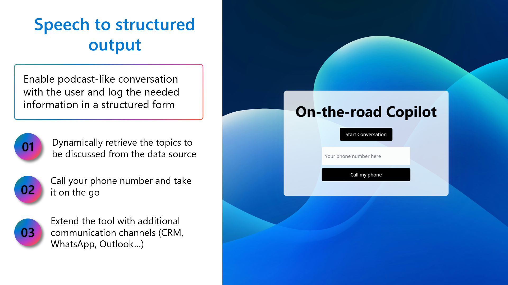
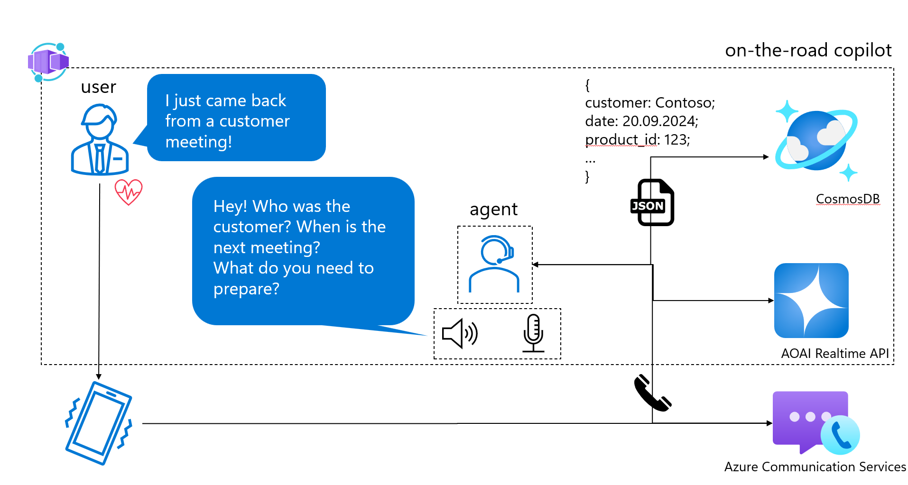

<h1 align="center">
  <br>
  <a href=""></a>
  <br>
  on-the-road copilot 🤖
  <br>
</h1>

<h4 align="center">A minimal speech-to-structured output app built with Azure OpenAI Realtime API.</h4>
</p>


## Problem we are addressing

- **Documentation overhead**: dealing with high volumes of documents and having at the same time not enough time in the day to maintain/fill them in;
- **Information loss**: if it takes a document or a form too long to be filled - information will get lost!


## Key features and technical details



- Backend: python
- Frontend: minimal JS, CSS/HTML

The app has minimal dependencies to allow for easy extension and integration with other communication channels and applications.

## Architecture


## How to set up the Azure environment

To run this application, you can provision the resources using azure developer CLI.

From your command line:

```bash
echo "log into azure dev cli - only once"
azd auth login

echo "provisioning all the resources with the azure dev cli"
azd up

# The following values should work:
# location=northeurope
# aiResourceLocation=swedencentral

echo "get and set the value for AZURE_ENV_NAME"
source <(azd env get-values | grep AZURE_ENV_NAME)

echo "building and deploying the streamlit user interface"
bash ./azd-hooks/deploy.sh app $AZURE_ENV_NAME
```

> **Note**
> If you do not provision a cosmosDB, you can still run the app using the local sample files. To replace the data source, substitute the cosmosdb module.


## Contributors

- [Masha Stroganova](https://www.linkedin.com/in/masha-stroganova/)
- [Dennis Zielke](https://www.linkedin.com/in/dennis-zielke-b24303123/)
- [Andreas Kopp](https://www.linkedin.com/in/andreas-kopp-1947183/)

## Related

[voice RAG](https://github.com/Azure-Samples/aisearch-openai-rag-audio) - RAG + Voice Using Azure AI Search and the GPT-4o Realtime API for Audio


## Disclaimer

This is an open-source repository and it does not have official support from Microsoft. Use at your own risk 😉

For production scenarious, questions and bugs please open a Github issue.
