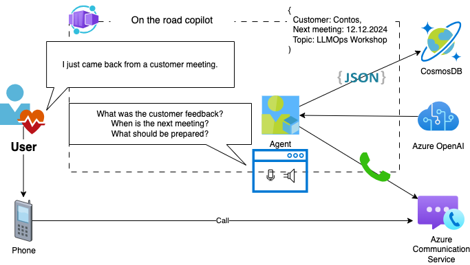

# on-the-road-copilot

A copilot that process voice input into structured reports:



## How to set up azure environment

The following values should work:

location=northeurope
aiResourceLocation=swedencentral

```
echo "log into azure dev cli - only once"
azd auth login

echo "provisioning all the resources with the azure dev cli"
azd up

echo "get and set the value for AZURE_ENV_NAME"
source <(azd env get-values | grep AZURE_ENV_NAME)

echo "building and deploying the streamlit user interface"
bash ./azd-hooks/deploy.sh web $AZURE_ENV_NAME
```